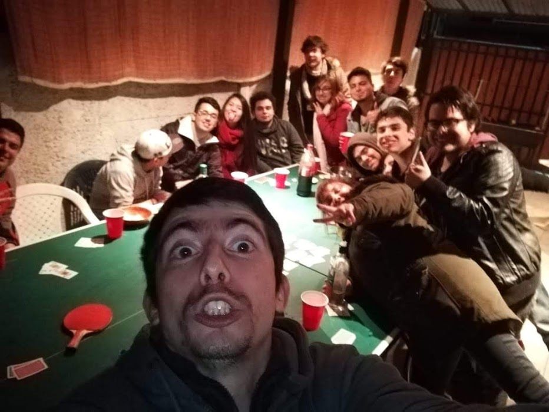
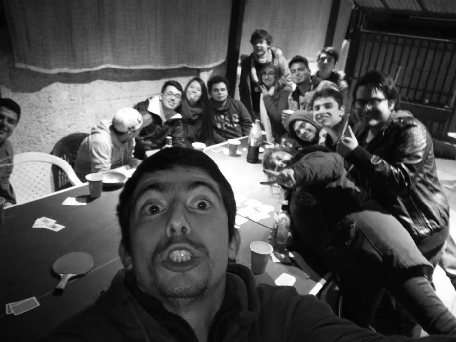
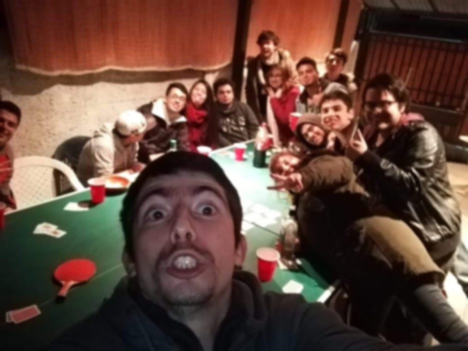

# Proyecto manipulacion de imagenes con Openmpi Computacion Paralela y Distribuida

## Yerko Foncea - Lucas Carmona - Brayan Parra

### Requisitos:

Maquinas preparadas para permitir conexiones ssh, como se hizo en clases, con las llaves compartidas entre ellas, ademas de tener montada una carpeta compartida entre las maquinas.

Es necesario que el programa este en la carpeta compartida entre las maquinas.

Tener instaladas las lbreria opencv para manipulacion de imagenes en las maquinas
```
    $ sudo apt-get install libopencv-dev
```

Tener instaladas las librerias de openmpi en las maquinas
```
    $ sudo apt-get libopenmpi-dev
```
Es necesario editar el archivo txt de maquinas con las ip de las maquinas a trabajar

Para crear output situarse en directorio /src como se muestr a continuacion, realizar el make del output y finalmente correr el programa con la ultima linea, indicando el path de la imagen seguida por la operacion, todo separado por espacio

```
    $ cd src
    $ make
    $ mpirun mpirun --hostfile maquinas.txt ./dist/programa <operacion> <path de la imagen> 
```

#### Operaciones aceptadas
    - Operacion 1 para escala de grises
    - Operacion 2 para filtro gaussiano
    - Operacion 3 para escalado de imagen al doble

### Limitaciones:

    - Necesario mas de un procesador
    - No se permiten imagenes animadas

### Imagenes luego de aplicar el filtro

### Imagen original


### Imagen con escala de grises


### Imagen con filtro gaussiano


### Imagen reescalada

